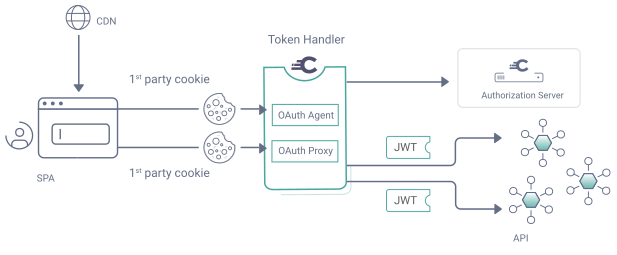
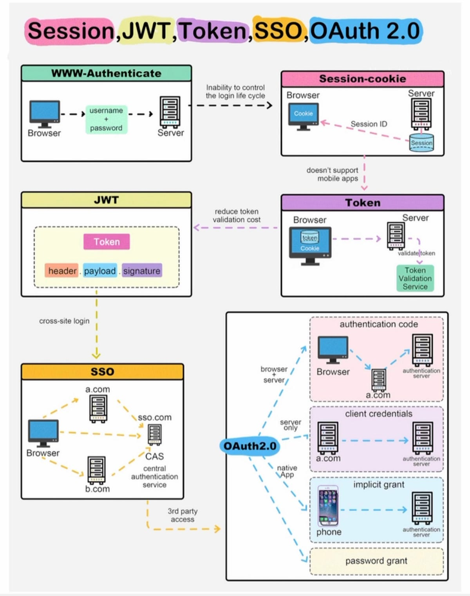
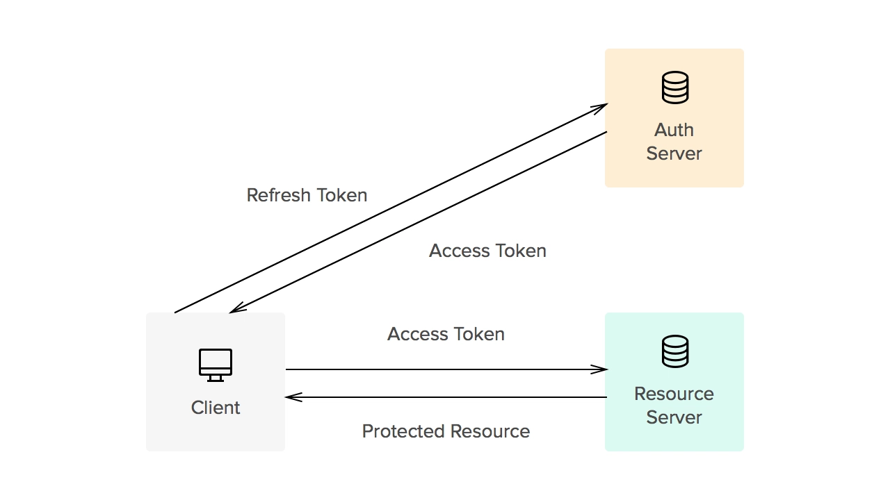
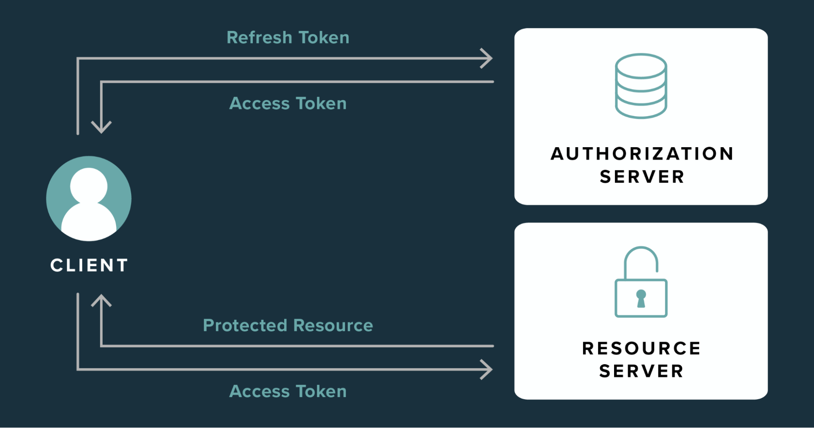
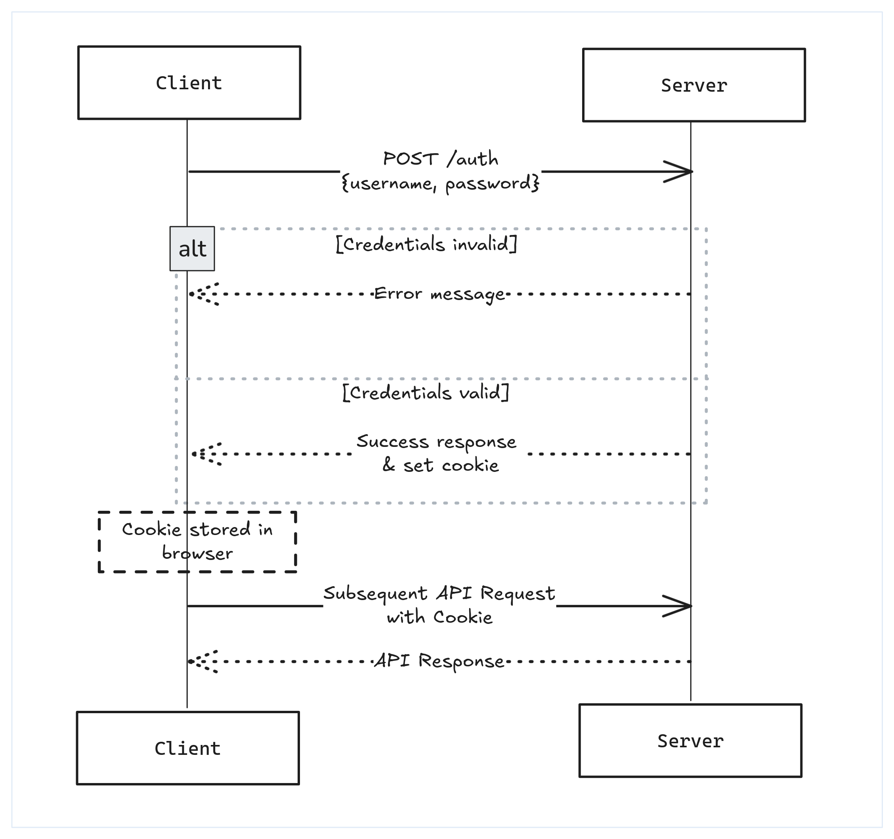
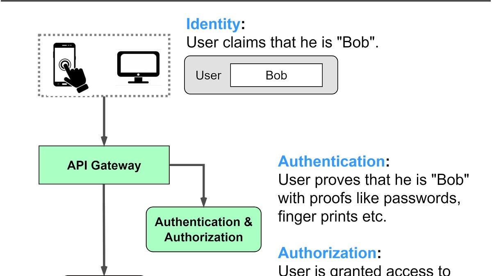

---

# 🚀 Backend Mastery – Django Backend Engineering Roadmap

<div align="center">


</div>

**A practical backend engineering learning journey using Django and Django REST Framework.**

This repository demonstrates how backend systems evolve from **basic CRUD APIs to production-style architecture including authentication, payments, OAuth, and background processing.**

[Features](#-features) • [Phases](#-learning-phases) • [Installation](#-installation) • [Tech Stack](#-tech-stack)

</div>

---

# 🌟 Features

### Backend Engineering Concepts Covered

* 🔧 **Django Project Architecture**
* 🔌 **REST APIs with Django REST Framework**
* 🔐 **Authentication & Authorization**
* 🧑‍💻 **Owner-based Data Access**
* 🛡 **Permission Systems**
* 📷 **File & Image Handling**
* 💳 **Stripe Payment Gateway**
* ⚡ **Background Tasks with Celery**
* 🔑 **JWT Authentication**
* 🌐 **Google OAuth Login**
* 📡 **Secure API Design**

---

# 🧭 Learning Phases

This repository is organized as a **7-phase backend learning roadmap**, where each phase introduces new backend concepts.

---

# Phase 1 – Project Setup

* Django project: `backend_mastery`
* Database: `db.sqlite3`
* Base settings and project configuration
* URL routing and application structure

---

# Phase 2 – CRUD API (`api1_crud`)

### Model

`Task`

Fields:

* title
* description
* is_completed
* created_at

### API

Uses **Django REST Framework ModelViewSet**

### Endpoints

```
GET /tasks/
POST /tasks/
GET /tasks/{id}/
PUT/PATCH /tasks/{id}/
DELETE /tasks/{id}/
```

---

# Phase 3 – Posts API (`api2_posts`)

### Model

`Post`

Fields:

* title
* content
* img
* owner
* created_at

### Features

* Owner automatically assigned from authenticated user
* Queryset filtered to only show **user's own posts**

### Endpoints

```
GET /posts/
POST /posts/
GET /posts/{id}/
PUT/PATCH /posts/{id}/
DELETE /posts/{id}/
```

---

# Phase 4 – Secure Posts API (`api3_secure_posts`)

### Model

`SecurePost`

Fields:

* title
* content
* image
* owner
* created_at

### Security

* `IsAuthenticated` permission
* Image cleanup on update/delete

### Endpoints

```
GET /secure-posts/
POST /secure-posts/
GET /secure-posts/{id}/
PUT/PATCH /secure-posts/{id}/
DELETE /secure-posts/{id}/
```

### Images


---

# Phase 5 – Exam Blog (`exam_blog`)

### Model

`Article`

Fields:

* title
* body
* cover_img
* owner
* created_at

### Permissions

* `IsAuthenticatedOrReadOnly`
* `IsOwnerOrReadOnly` (custom permission)

### Features

* Image cleanup on update/delete
* Owner-restricted modifications

### Endpoints

```
GET /articles/
POST /articles/
GET /articles/{id}/
PUT/PATCH /articles/{id}/
DELETE /articles/{id}/
```

---

# Phase 6 – Payment Gateway (`Gateway`)

### Models

**Product**

```
name
description
price
```

**Order**

```
user
product
price_at_purchase
status
```

**Transaction**

```
order
gateway
transaction_id
amount
status
```

### Stripe Integration

Endpoints:

```
POST /create-checkout-session/
POST /webhook/
```

### Celery Background Task

Example:

```
send_welcome_email
```

Located in:

```
Gateway/tasks.py
```

### Images


---

# Phase 7 – Authentication System (`test1`)

### Models

**Test**

```
owner
test_score
rank
is_medical_clear
```

**Profile**

```
OneToOne with User
token_version
```

### Authentication

* Custom JWT token serializer
* Refresh token blacklisting
* Google OAuth login

### Permissions

* `IsOwnerOrReadOnly`
* `IsAdminGroup`

### Endpoints

```
POST /register/
POST /api/token/
POST /api/logout/
POST /admin-test/
GET /auth/google/login/
GET /auth/google/callback/
CRUD /tests/
```

### Images
















---

# ⚙ Installation

Clone repository

```
git clone https://github.com/salamlakhan7/7-phases-.git
cd 7-phases-
```

Create virtual environment

```
python -m venv venv
venv\Scripts\activate
```

Install dependencies

```
pip install -r requirements.txt
```

Run migrations

```
python manage.py migrate
```

Run server

```
python manage.py runserver
```

---

# 🛠 Tech Stack

### Backend

* Python
* Django
* Django REST Framework
* JWT (SimpleJWT)
* Google OAuth
* Celery
* Redis
* Stripe API

### Database

* SQLite (development)
* PostgreSQL recommended for production

---

# 📁 Project Structure

```
backend_mastery/
│
├── api1_crud
├── api2_posts
├── api3_secure_posts
├── exam_blog
├── Gateway
├── test1
│
├── backend_mastery/
│   ├── settings.py
│   ├── urls.py
│   ├── asgi.py
│   └── wsgi.py
│
├── media/
├── req_Images/
├── manage.py
└── README.md
```

---

# 👨‍💻 Author

**Abdul Salam**

GitHub
[https://github.com/salamlakhan7](https://github.com/salamlakhan7)

---

# ⭐ Support

If you find this project useful, consider giving it a **star ⭐ on GitHub.**

---

If you want, I can also show you **one small addition (a system architecture diagram) that would make this README look like a senior backend portfolio project.**
